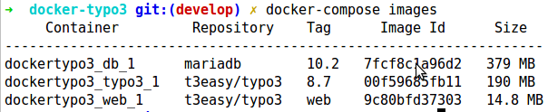
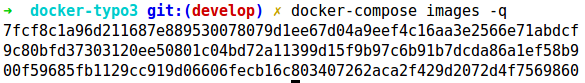

===================
A TYPO3 environment
===================

.. highlight:: shell
.. default-role:: code

How to install for development
==============================

#. Clone or download the repository to `./docker-typo3`. Go there::

      cd ./docker-typo3

#. Build and start the containers::

      docker-compose up -d

#. Create the `FIRST_INSTALL` file for TYPO3::

      docker-compose exec typo3 touch /app/web/FIRST_INSTALL

#. Make sure the domain `web.typo3` resolves to 127.0.0.1 (localhost) on your host machine
   where you have your Docker running.

#. Setup TYPO3

   -  With TYPO3 Console::

         docker-compose exec typo3 \
            /app/vendor/bin/typo3cms install:setup \
            --non-interactive \
            --database-name="typo3" \
            --database-user-name="typo3" \
            --database-user-password="typo3" \
            --database-host-name="db" \
            --database-port="3306" \
            --use-existing-database \
            --admin-user-name="admin" \
            --admin-password="password" \
            --site-setup-type="site" \
            --site-name="TYPO3 Demo"

   -  Or in the browser the tradional way at http://web.typo3/typo3/

#. Go to http://web.typo3/ for the TYPO3 frontend

#. Go to http://web.typo3/typo3/ for the TYPO3 backend. Use 'admin' as user and 'password'
   as password.

How to install AGAIN for development
====================================

Before you destroy an existing build you may want to do some inspections first. You
would do so if you want to remove and destroy the data volumes as well. The inspection
helps finding their names.

Inspect
-------

Here are some command examples. Values may be different for your instances.

Inspect the images
~~~~~~~~~~~~~~~~~~

Command:

Here we find the *container names* for later use::

   # List images used by the created containers.
   docker-compose images

Result:

Command:

For your interest::

   # list the images and only show the IDs
   docker-compose images -q

Result:

Command:

For your interest::

   # print a long json text with all the knowledge
   docker-compose images -q | xargs docker inspect

Result:

... will print a long json text

Inspect the containers
~~~~~~~~~~~~~~~~~~~~~~

#. Go to the root folder::

      cd docker-typo3

#. Make sure the containers exist::

      # build, (re)create, start, and attach to containers for a service
      # run as daemon
      docker-compose up -d

      # list what's running
      docker ps

#. The containers need not be running for the next step::

      # Stop one or more running containers
      docker-compose stop

#. Inspect the containers showing the complete json::

      docker inspect dockertypo3_db_1
      docker inspect dockertypo3_typo3_1
      docker inspect dockertypo3_web_1

#. Specificly find out what VOLUMES are used::

      docker inspect dockertypo3_db_1 \
         --format='Container "{{.Name}}" uses volume(s):{{range .Mounts}} "{{ .Name }}"{{end}}'

      docker inspect dockertypo3_typo3_1 \
         --format='Container "{{.Name}}" uses volume(s):{{range .Mounts}} "{{ .Name }}"{{end}}'

      docker inspect dockertypo3_web_1 \
         --format='Container "{{.Name}}" uses volume(s):{{range .Mounts}} "{{ .Name }}"{{end}}'

   Result:

   .. figure:: Documentation/Images/003-inspect-containers-for-volumes.png
      :class: with-shadow

Understand
----------

Compare the results of the inspection with your system::

   # list images
   docker images

   # list running containers
   docker container

   # or   list running containers
   docker ps

   # list all containers
   docker container -a

   # or  list all containers
   docker ps -a

   # list networks
   docker network ls

   # list volumes
   docker volume ls

Destroy
-------

#. Go to the root folder::

      cd docker-typo3

#. Remove the images, containers and networks::

      # Stop containers and remove containers, networks, images
      # and volumes (?) created by `up`:
      docker-compose down

#. Verify that the volumes still exist::

      # list volumes:
      docker volume ls

#. Decide whether you want to remove the volumes as well.

   Method 1::

      # Easy but dangerous: Remove ALL unused volumes from your system
      docker volume prune

   Method 2::

      # Only and explicitely remove our named volumens
      docker volume rm dockertypo3_db
      docker volume rm dockertypo3_typo3

Install again
-------------

Start all over with `How to install for development`_.

Build and run
=============

#. `docker-compose -f docker-compose.yml -f docker-compose.build.yml build --no-cache`

#. `docker-compose up -d`

